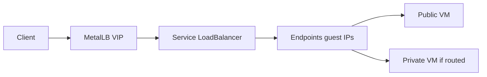

# Load Balancer plan (AWS-style)

Tracking: [virtfoundry/core#63](https://github.com/virtfoundry/core/issues/63) · Traction board Phase 0.

## Goal

Tenant L4 load balancing for VM workloads, modeled after **AWS NLB** (not CloudStack “rule + assign VMs”).

```
LoadBalancer          → VIP (MetalLB LoadBalancer Service)
  └── Listener        → protocol + front port → TargetGroup
        └── TargetGroup
              └── Target → VM (public and/or private NIC IP when reachable)
```

## Why AWS-style

| Concern | CloudStack-like | AWS-style (chosen) |
|---------|-----------------|--------------------|
| Front vs back | Coupled on LB rule | VIP separate from Target Group |
| Private + public | Awkward | Targets are IPs; reachability is dataplane |
| Health / weight | On rule | On Target Group (v1.1+) |
| Terraform mental model | Weak | Strong |

## Homelab v1 defaults

| Topic | Choice |
|-------|--------|
| VIP pool | MetalLB / Helm `reservedRanges` `10.0.50.100–150` |
| Guest IP pool | Shared public `10.0.50.10–99` (must not overlap VIP) |
| Protocol | TCP |
| Targets | VM NIC IP — public preferred; private if nodes can reach Multus CIDR |
| Health checks | Deferred (v1.1) |
| Multus Security Groups | Out of scope v1 |



## API sketch

Prefix `/api/v1`, JWT + tenant scope:

| Area | Endpoints |
|------|-----------|
| LB | `GET/POST /load-balancers`, `GET/PATCH/DELETE /load-balancers/{id}` |
| Listeners | `POST/DELETE /load-balancers/{id}/listeners` (`port`, `protocol`, `target_group_id`) |
| Target groups | `GET/POST /target-groups`, `GET/DELETE /target-groups/{id}` |
| Targets | `POST /target-groups/{id}/targets` (`vm_id`), `DELETE .../targets/{tid}` |

Create LB → create empty `Service` type LoadBalancer → persist VIP from `.status.loadBalancer`. Sync Service ports from listeners; sync Endpoints from registered target IPs + instance ports.

## Implementation order

1. Domain models + Memory/kubernetes store — **done** (homelab uses CRD ephemeral store)
2. `k8s.Manager`: EnsureLBService / SyncLBEndpoints / DeleteLB — **done**
3. Service layer + HTTP handlers — **done** (create/list/delete LB, listeners, target groups, register target)
4. UI: Load Balancers + Target Groups (PageTable pattern) — pending
5. Enforce `reservedRanges` when seeding VM IP pools — pending
6. Homelab E2E + Features guide — **E2E** `scripts/e2e/test-load-balancer.sh` passes (create TG/LB/listener + cleanup)

## v1 scope (merged 2026-09)

REST only; no cluster-wide MetalLB/Cilium changes from the API.

| Action | K8s effect |
|--------|------------|
| `POST /load-balancers` | Metadata only — **no** `Service` yet |
| `POST .../listeners` | First listener creates `Service` `type: LoadBalancer` in **tenant namespace** (`virtfoundry-tenant-*`) |
| `POST /target-groups/.../targets` | Manual `Endpoints` with VM NIC IPs (Multus/public) |
| `DELETE /load-balancers/{id}` | Deletes tenant `Service` + `Endpoints` only |

Labels: `virtfoundry.io/managed-by`, `virtfoundry.io/load-balancer={id}`.

## Homelab safety

What **does not** happen (vs experiments that stressed the cluster):

- No edits to MetalLB `IPAddressPool`, L2Advertisement, or Cilium config
- No `Service` in `kube-system`, `metallb-system`, or default namespace
- No VIP allocation until a **listener** exists (empty LB is store-only)
- `syncLBEndpoints` errors are non-fatal on listener create (missing RBAC used to surface as 500; now listener succeeds, endpoints sync when SA has `endpoints` verb — helm-charts #25)

Residual risks: each listener still requests one MetalLB VIP from the tenant pool (`10.0.50.100–150`); orphan Services left outside the API would hold IPs. E2E always deletes LB/TG/listener. Prefer Argo-managed deploy over manual `kubectl patch` on cluster networking.

## Risks

- **Multus Endpoints:** kube-proxy must forward to guest IPs on `vf-pub0` / isolated NAD. Validate early; fallback = in-cluster proxy or extra routes.  
- **Private targets:** API accepts them; reject or mark unhealthy when path is not routable until VPC routing lands.

## Non-goals (v1)

- ALB (HTTP path/host rules), TLS termination, sticky sessions, UDP  
- Floating IP without Target Group  
- Terraform provider resource (follow-up)

## Related

- [ROADMAP.md](../ROADMAP.md) — production hardening  
- [ROADMAP.md](../ROADMAP.md) — Now / networking  
- [CNCF-CHECKLIST.md](./CNCF-CHECKLIST.md) — Phase 0 board tracking (product item; not a CNCF doc exit criterion)
